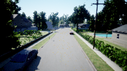
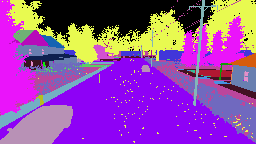
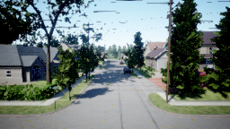
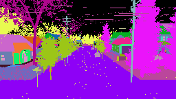

# This file contains the setup instructions for AirSim simulator specifically for autonomous drone simulations.

### 1. **Install and setup conda environment**

* Download the installer for linux
* ```
  sudo apt-get update

  # install prerequisite libraries
  apt-get install libgl1-mesa-glx libegl1-mesa libxrandr2 libxrandr2 libxss1 libxcursor1 libxcomposite1 libasound2 libxi6 libxtst6

  # following two steps are for your downloadedFile
  Shasum -a 256 ./Anaconda_downloaded_file.sh

  Chmod +x ./Anaconda_downloaded_file.sh

  source ~/.bashrc 

  conda -version
  ```

### 2.  Install and setup Unreal Engine

* Connect github to EpicGames account and download Unreal Engine for Linux
* Execute the ``unreal_engine_setup.sh`` file from scripts folder.

### 3. Download AirSim

* Clone AirSim repository from [github](https://github.com/microsoft/AirSim)
* Make the following changes to build - [Follow this youtube video](https://www.youtube.com/watch?v=jJ4mqo4Ge8U&t=585s)
* Execute ``airsim_setup.sh`` file from scripts folder.

### 4. Download Binaries

* For Linux - [Link](https://github.com/Microsoft/AirSim/releases)
  
  Download the `AirSimNH.zip` file to follow this tutorial, extract the files and then run the following commands

### 5. Run Simulation

* ```
  # Run the binary file to start neighbourhood simulation enviroment of AirSim
  chmod +x ./AirSimNH.sh 
  ./AirSimNH.sh -windowed
  ```

* **Script for drone simulation and data capturing**
  The ``path.py`` file in scripts is present inside ``AirSim/PythonClient/multirotor`` folder, execute this file to run simulation and generate synthetic data from cameras.

* ``setings.json`` file is created once you start the bianry for the first time, see the [docs](https://microsoft.github.io/AirSim/settings/) to make chnages. the one used in this tutorial is present in the scripts folder.
  
* This step will generate image data from drone sensors(depth, segmentation and original image data)
  ##### run the python code [scripts/generate_data.py](scripts/generate_data.py)
  ##### make sure to cop this file in AirSim/PythonClient/multirotor folder before running since this script uses a `setup_path.py` file provided by AirSim
  ```
  # This file should be present in the AirSim/PythonClient/multirotor folder
  python3 ./generate_data.py
  ```
  #### Here are the results for this step :

  **Results are in `out/airsim_generate_data` folder**
    
  #### Image
  

  #### Segmentation
  

  #### Depth
  

* This step will generate image data from drone sensors(depth, segmentation and original image data) along with the ground truth labels
  ##### run the python code [scripts/generate_data_and_ground_truth.py](scripts/generate_data_and_ground_truth.py)
  ##### make sure to cop this file in AirSim/PythonClient/multirotor folder before running since this script uses a `setup_path.py` file provided by AirSim
  ```
  # This file should be present in the AirSim/PythonClient/multirotor folder
  python3 ./generate_data_and_ground_truth.py
  ```
  #### Here are the results for this step :

  **Results are in `out/airsim_get_ground_truth` folder**

  ### Ground Truth Labels - data from drone sensors
  ```
  Position: <Vector3r> {   'x_val': 0.001768288784660399,
    'y_val': -3.83308744430542,
    'z_val': -5.494985580444336}
  Orientation: <Quaternionr> {   'w_val': -0.7062404155731201,
    'x_val': -0.028552450239658356,
    'y_val': 0.02919490821659565,
    'z_val': -0.7067934274673462}
  Velocity: <Vector3r> {   'x_val': -0.015148111619055271,
    'y_val': 11.24450397491455,
    'z_val': 0.1306181252002716}
  Angular_Velocity: <Vector3r> {   'x_val': -0.00037339984555728734,
    'y_val': 0.08318130671977997,
    'z_val': -0.0012482452439144254}

  ```
    
  #### Image
  

  #### Segmentation
  

  #### Depth
  


### 6. Get Google Maps for running simulations in Custom Environment

* **Create a custom binary with google maps API to get a real world environment for simulation using unreal engine and Cesium plugin.**

  #### The Installation steps are similar to AirSim

* Step 1
  ```
  # Clone the Unreal Engine source code
  git clone -b 4.27 https://github.com/EpicGames/UnrealEngine.git
  cd UnrealEngine

  # Run the setup script
  ./Setup.sh

  # Generate project files
  ./GenerateProjectFiles.sh

  # Build Unreal Engine
  make

  ```

* Step 2
  
  Make the following changes to build - [Follow this youtube video](https://www.youtube.com/watch?v=jJ4mqo4Ge8U&t=585s)

  ```
  # Clone the AirSim repository
  git clone https://github.com/microsoft/AirSim.git
  cd AirSim

  # Run the build script
  ./build.sh
  ```

* Step 3 - Launch Unreal Engine & create a new blank project
  
  Download the cesium plugin for Unreal Engine [Link](https://github.com/CesiumGS/cesium-unreal/releases)

  ```
  copy it inside /<path to unreal>/Engine/plugins
  will have to build Unreal Engine Again

  ```

* Step 4 - Google Maps API
  For Cesium need Google Maps API - Need a google cloud account - free tier provides the API :)

  - Launch UnrealEditor
  - Edit -> Enable cesium plugin -> restart editor
  - Add layer & components
  - Add -> `API KEY` in Cesium3Dtileset
  - Enable Cesium GeoReference 
  - Input Longitude & Latitude

  **Can also connect Cesium ION with Epic Games Account -> `No need for Google API then`**
